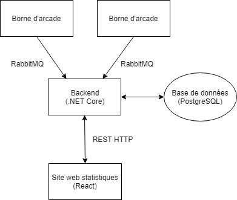

# Configuration du service back-end

## Présentation

Le service back-end est un service centralisé permettant de stocker en base de données
les statistiques des différentes bornes d'arcades et de les exposer.

Les données sont stockées sur une base de données PostgreSQL.

Les bornes d'arcades communiquent avec le service en utilisant RabbitMQ. L'utilisation
de RabbitMQ plutôt qu'un autre protocol (comme HTTP) a les intérêts suivants :
* Possibilité de mettre en attentes les communications avec la borne d'arcade si le 
service est temporairement hors ligne
* Gestion robuste des pertes de messages

Enfin, les données statistiques sont exposées par le service en HTTP.

On peut représenter cela avec le schéma suivant :



## Pré-requis logiciels

Pour que le service fonctionne, il est nécessaire d'installer les logiciels suivants :
* [Erlang/OTP](http://www.erlang.org/downloads) (pour RabbitMQ) : 21.3+
* [RabbitMQ](https://www.rabbitmq.com/download.html) : 3.7.14+
* [.NET Core Runtime](https://dotnet.microsoft.com/download) 2.2+
* [PostgreSQL](https://www.postgresql.org/download/) : 11+

## Configuration

Côté service, la configuration se fait sur les fichier `appsettings.json` et 
`appsettings.Development.json` (si vous développez). Vous devez y configurer :
* La connexion au serveur RabbitMQ 
* La connexion à la base de données PostgreSQL
* L'identifiant et le mot de passe utilisés pour se connecter à l'interface web

```json
{
  "rabbitMq": {
    "ip": "localhost",
    "login": "guest",
    "password": "guest",
    "queueNames": {
      "gameLaunched": "arcade_nomad_game_launched"
    }
  },
  "postgresql": "Host=localhost;Database=postgresql;Username=postgres;Password=admin",
  "authentication": {
    "login": "guest",
    "password": "guest"
  }
}
```

Côté application électron, celle-ci se fait sur le fichier `config.json`. Deux choses
en particulier y sont à configurer :
* Le champ `arcadeId`, un identifiant qui doit être unique entre toutes les bornes
* La connexion RabbitMq

```json
{
  "arcadeId": 0,
  "rabbitMq": {
    "ip": "localhost",
    "login": "guest",
    "password": "guest",
    "queueNames": {
      "gameLaunched": "arcade_nomad_game_launched"
    }
  }
}
```

Assurez-vous bien que la configuration de RabbitMQ est identique entre les deux fichiers !

