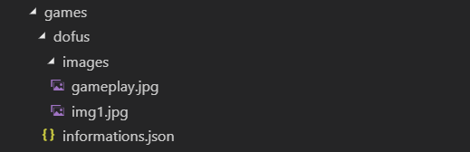

# Notice d'utilisation

## Configuration des jeux

Le répertoire `/games` contient les dossiers de chaque jeu. Voici son organisation :



### Fichier `informations.json`

Ce fichier contient la configuration du jeu. Il est indispensable. Voici un exemple de ce fichier:

```json
{
  "name": "Dofus",
  "exePath": "C:\\/Users/Eliot/Downloads/Minigames/TCHERNODATE.exe",
  "presentation": {
    "jacket": "images/img1.jpg",
    "pictures": ["images/gameplay.jpg"]
  },
  "genres": ["MMORPG", "Hack'n'slash"],
  "informations": {
    "editor": "Ankama",
    "pegi": "3",
    "qrcode": "code",
    "link": "https://dofus.com"
  },
  "keybinds": {
    "0": {
      "ARROW_UP": "Up",
      "ARROW_DOWN": "Down",
      "ARROW_LEFT": "Left",
      "ARROW_RIGHT": "Right",
      "BOTTOM_LEFT": "P",
      "RIGHT": "M",
      "LEFT": "K",
      "TOP_RIGHT": "O",
      "TOP_LEFT": "I",
      "CENTER": "L",
      "START": "Y"
    },
    "1": {
      "ARROW_UP": "Z",
      "ARROW_DOWN": "S",
      "ARROW_LEFT": "Q",
      "ARROW_RIGHT": "D",
      "BOTTOM_LEFT": "V",
      "RIGHT": "H",
      "LEFT": "F",
      "TOP_RIGHT": "T",
      "TOP_LEFT": "R",
      "CENTER": "G",
      "START": "Y"
    }
  },
  "keyTexts": {
    "ARROW_UP": "Up",
    "ARROW_DOWN": "Down",
    "ARROW_LEFT": "Left",
    "ARROW_RIGHT": "Right",
    "BOTTOM_LEFT": "W",
    "RIGHT": "Avancer",
    "LEFT": "Reculer",
    "TOP_RIGHT": "Sauter",
    "TOP_LEFT": "Texte un peu long",
    "CENTER": "S",
    "START": "Y",
    "SELECT": "Hold to quit"
  }
}
```

#### Description des propriétés d'un jeu

| Propriété     | Description         
| ------------- |------------- |
| name          | Nom du jeu |
| exePath       | Chemin vers l'exécutable du jeu à lancer |
| presentation.jacket | Chemin vers l'image de la jacket du jeu      |
| presentation.pictures | Tableau de chemins vers les images/vidéos du jeu |
| genres | Tableau de genres |
| informations.editor | Nom de l'éditeur du jeu |
| informations.pegi | Pegi du jeu |
| informations.link | Lien vers le site web du jeu |
| keybinds.**x** | Objet contenant les redirections à effectuer pour chaque touche du gamepad. Le "**x**" correspond à l'id du gamepad (0 ou 1 dans l'exemple ci-dessus). Il faut se référer au [lien vers la liste des boutons du gamepad et du clavier](./liste_touches.md) afin de découvrir quelles sont les boutons et touches disponibles. |
| keyTexts | Objet contenant l'association des boutons du gamepad avec leurs actions respectives. Il faut se référer au [lien vers la liste des boutons du gamepad et du clavier](./liste_touches.md) |

### Modifier la liste des jeux

Pour ajouter ou supprimer un jeu, il suffit de modifier le répertoire `/games` et de relancer l'application.

## Configuration du logiciel

Le fichier `config.json` contient la configuration du logiciel.

```json
{
  "arcadeId": 0,
  "service": {
    "enabled": true,
    "rabbitMq": {
      "ip": "localhost",
      "login": "guest",
      "password": "guest",
      "queueNames": {
        "gameLaunched": "arcade_nomad_game_launched",
        "gameRating": "arcade_nomad_game_rating"
      }
    }
  },
  "pauseImages": [
    {
      "path": "pause/1-Paris.jpg",
      "extension": "jpg"
    },
    {
      "path": "pause/2-Filou.JPG",
      "extension": "jpg"
    },
    {
      "path": "pause/3-Nomad.png",
      "extension": "png"
    }
  ],
  "monitoring": {
    "enabled": true,
    "secondsInterval": 120
  },
  "controllers": {
    "timeUntilInactivity": 30000,
    "longpressSelect": 2000,
    "gamepad": {
      "enabled": true
    },
    "keyboard": {
      "enabled": true
    }
  },
  "defaultGenre": "Tous les jeux",
  "standardKeys": {
    "ARROW_UP": "ARROW_UP",
    "ARROW_DOWN": "ARROW_DOWN",
    "ARROW_LEFT": "ARROW_LEFT",
    "ARROW_RIGHT": "ARROW_RIGHT",
    "BOTTOM_LEFT": "BOTTOM_LEFT",
    "RIGHT": "RIGHT",
    "LEFT": "LEFT",
    "TOP_RIGHT": "TOP_RIGHT",
    "TOP_LEFT": "TOP_LEFT",
    "CENTER": "CENTER",
    "SELECT": "SELECT",
    "START": "START"
  },
  "keyboardKeys": {
    "38": "ARROW_UP",
    "40": "ARROW_DOWN",
    "37": "ARROW_LEFT",
    "39": "ARROW_RIGHT",
    "87": "BOTTOM_LEFT",
    "68": "RIGHT",
    "81": "LEFT",
    "69": "TOP_RIGHT",
    "65": "TOP_LEFT",
    "83": "CENTER",
    "66": "SELECT",
    "78": "START"
  },
  "joystickAxis": {
    "HORIZONTAL": 4,
    "VERTICAL": 3
  },
  "gamepadKeys": {
    "5": "BOTTOM_LEFT",
    "11": "RIGHT",
    "4": "LEFT",
    "2": "TOP_RIGHT",
    "3": "TOP_LEFT",
    "15": "CENTER",
    "0": "SELECT",
    "1": "START"
  },
  "keys": {
    "textSizePercentage": 1.5,
    "joystickPlacement": {
      "xPercentage": 16,
      "yPercentage": 65,
      "color": "black",
      "radiusPercentage": 7,
      "textDistancePercentage": 6
    },
    "buttonPlacements": {
      "START": {
        "xPercentage": 95,
        "yPercentage": 2,
        "color": "white",
        "radiusPercentage": 5,
        "displayText": {
          "enabled": true,
          "angleDeg": 90,
          "distancePercentage": 7,
          "xAlign": "center",
          "yAlign": "center"
        }
      },
      "SELECT": {
        "xPercentage": 5,
        "yPercentage": 2,
        "color": "white",
        "radiusPercentage": 5,
        "displayText": {
          "enabled": true,
          "angleDeg": 90,
          "distancePercentage": 7,
          "xAlign": "center",
          "yAlign": "center"
        }
      },
      "CENTER": {
        "xPercentage": 64.5,
        "yPercentage": 50,
        "color": "red",
        "radiusPercentage": 5,
        "displayText": {
          "enabled": true,
          "angleDeg": 80,
          "distancePercentage": 7,
          "xAlign": "left",
          "yAlign": "center"
        }
      },
      "RIGHT": {
        "xPercentage": 77,
        "yPercentage": 50,
        "color": "red",
        "radiusPercentage": 5,
        "displayText": {
          "enabled": true,
          "angleDeg": 0,
          "distancePercentage": 7,
          "xAlign": "left",
          "yAlign": "center"
        }
      }
    }
  }
}
```

#### Description des propriétés du fichier de configuration

| Propriété     | Description         
| ------------- |------------- |
| arcadeId      | Id de la borne d'arcade |
| service       | Configuration liée au back-end |
| service.enabled       | Boolean pour activer/désactiver le service |
| service.rabbitMq       | Configuration du rabbitMq |
| service.rabbitMq.ip       | IP du serveur hébergeant le broker |
| service.rabbitMq.login       | Login pour s'authentifier |
| service.rabbitMq.password       | Password pour s'authentifier |
| service.rabbitMq.queueNames       | Liste des queues |
| pauseImages       | Tableau d'objet représentant les images (path et extension) |
| monitoring       | Configuration du monitoring des jeux |
| monitoring.enabled       | Boolean pour activer/désactiver le monitoring |
| monitoring.secondsInterval | Interval de temps entre chaque mesure en secondes |
| controllers | Configuration des controleurs |
| controllers.timeUntilInactivity | Temps nécessaire sans interaction pour déclencher l'écran de veille  |
| controllers.longpressSelect | Temps nécessaire de maintien du bouton Select pour quitter un jeu en cours  |
| controllers.gamepad | Configuration du service gamepad  |
| controllers.gamepad.enabled | Boolean pour activer/désactiver le service gamepad |
| controllers.keyboard | Configuration du service keyboard  |
| controllers.keyboard.enabled | Boolean pour activer/désactiver le service keyboard |
| defaultGenre | Genre par défaut au démarrage de l'application |
| standardKeys | Objet contenant la liste des touches standards du gamepad. Il sert surtout à typer dans le code et à éviter d'utiliser des strings. |
| keyboardKeys | Objet contenant l'association des keyCode du clavier avec les standardKeys |
| joystickAxis | Objet contenant l'association des axes vertical et horizontal aux ids renvoyé par le gamepad |
| gamepadKeys | Objet contenant l'association des identifiants des boutons envoyés par le gamepad au standardKeys |
| keys | Objet contenant la configuration de l'affichage des touches avant le lancement d'un jeu. |
| keys.textSizePercentage | Taille des labels des boutons |
| keys.joystickPlacement | Objet contenant la configuration du placement du joystick |
| keys.joystickPlacement.xPercentage | Position x du joystick en pourcentage |
| keys.joystickPlacement.yPercentage | Position y du joystick en pourcentage |
| keys.joystickPlacement.color | Couleur du joystick (css) |
| keys.joystickPlacement.radiusPercentage | Rayon du joystick en pourcentage |
| keys.joystickPlacement.textDistancePercentage | Distance entre le bouton et son label |
| keys.buttonPlacements | Objet contenant l'association des labels boutons à une position |
| keys.buttonPlacements.**x** | **x** est un label d'un bouton [(voir la liste des labels)](./liste_touches.md) |
| keys.buttonPlacements.**x**.xPercentage | Position x du bouton en pourcentage |
| keys.buttonPlacements.**x**.yPercentage | Position y du bouton en pourcentage |
| keys.buttonPlacements.**x**.color | Couleur du bouton ("red" ou "white") |
| keys.buttonPlacements.**x**.radiusPercentage | Rayon du bouton en pourcentage |
| keys.buttonPlacements.**x**.displayText | Configuration du label du bouton |
| keys.buttonPlacements.**x**.displayText.enabled | Boolean pour afficher/cacher le label du bouton |
| keys.buttonPlacements.**x**.displayText.angleDeg | Angle en degrées de la position du label en fonction du bouton |
| keys.buttonPlacements.**x**.displayText.distancePercentage | Distance en pourcentage entre le bouton et le label |
| keys.buttonPlacements.**x**.displayText.xAlign | Alignement x du texte ("center","left", "right") |
| keys.buttonPlacements.**x**.displayText.yAlign | Alignement y du texte ("center","left", "right") |

## Configuration des écrans de veille

Le répertoire `/pause` contient les images du diaporama de l'écran de veille. Il suffit donc de modifier le répertoire pour modifier le diaporama et d'ajouter les images dans le fichier `config.json`.